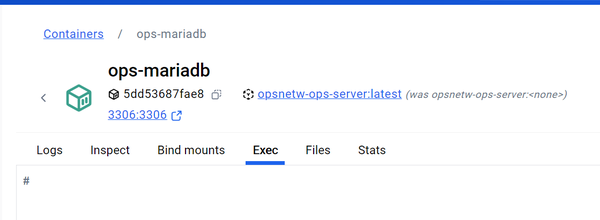

# Welkom

Dit is de repository voor een basis set van een client en server met Docker:

1. Debian (latest) genaamd  `ops-client`
2. Mariadb (v10.10) genaamd `ops-server`

# Inloggen op de client

Je kunt inloggen op de Linux client en dan verbinding maken met de database server. Hiervoor gebruiken we het account `student`
en wachtwoord `test1234`.

Dit doe je door in te een `shell` te starten. Er zijn drie opties:

1. Op afstand inloggen met SSH
2. Een `bash` shell starten via een `docker exec`.
3. Via de Docker Desktop applicatie.

## Inloggen met SSH

In Windows / Powershell / Opdrachtprompt kun je met `ssh` inloggen 'op afstand':

```
  c:\> ssh student@localhost
```

En dan in te loggen met `test1234`.

## Shell starten met docker exec
Of je start een `bash` shell vanaf de commando-regel:

```
  C:\> docker exec -it ops-client /bin/bash
```

(let op dat je nu bent ingelogd als `root` gebruiker en niet als `student` zoals bij `SSH`). Als je wilt wisselen naar
de `student` gebruiker voer dan het commando `su student` uit. 

## Docker desktop
Open de container `ops-client` in je Docker management software (bijv. Docker Desktop) en ga daar een `exec`. 




## Uitvoeren query op de database

Als je eenmaal een command-line interface hebt, dan kun je onderstaande commando uitvoeren om de verbinding
met de database-server (`ops-server`) te testen. Je moet inloggen met het wachtwoord `test1234!`. Merk op dat dit een ander wachtwoord
is dan de 

```bash
mysql -h ops-server -u root -p OperatingSystems < /home/student/work/query1.sql
```

**Uitleg**
Het commando dat we uitvoeren is `mysql` met een aantal *command line options* om het gedrag van de mysql-applicatie te 
veranderen:
  * `-h ops-server` : de optie `-h` maakt het mogelijk om de MariaDB server op te geven. In dit geval geven we de (DNS) 
      naam van de andere Docker container op: `ops-server`. 
  * `-u root`: de optie `-u` geeft de gebruiker die we willen inloggen. In MariaDB is een standaard gebruiker `root` 
     die we gebruiken (let op: dit is normaal gesproken **NIET** de bedoeling: gebruik geen `root` user).
  * `-p` : de optie `-p` geeft aan dat we een password willen invoeren nadat de applicatie gestart is. Dit is het wachtwoord
     voor de MariaDB `root`-gebruiker. Merk op dat hoewel de gebruikersnaam hetzelfde is als de Linux gebruikersnaam is 
     dit echt een ander account dat alleen binnen MariaDB bestaat.
  * `OperatingSystems`: dit is de naam van de database waar we de vraag aan willen stellen
  * `< /home/student/work/query1.sql`: door middel van Input/Output redirection (I/O redirection) sturen we de query 
    naar de command-line verwerker van MySQL.


Dit zou onderstaande tekst moeten leveren:
```text
command shortname  longname        description
ls      l          --long          Show more information
ls      a          -all            Show all items including thos beginning with .
```

Als dit gelukt is dan heb je succesvol verbinding gemaakt met je database.

## Afsluiten van de sessie

Om de login-sessie netjes te beëindigen gebruik je het commando `exit` (eventuele meerdere keren). Of je kunt op de toetsen
combinatie `ctrl+D` drukken (End-of-transmission).


# Database informatie
De database server zal tijdens het bouwen meteen een database bouwen, tabellen aanmaken en records inserten. 

## Aanmaken database en vullen van tabellen
Bij het bouwen van de Docker containers wordt een SQL-script gebruikt om de database aan te maken en daar tabellen en
records aan te maken voor deze tests.

Wil je zelf een andere database laten bouwen kijk dan naar de volgende bestanden en commando's:

* in het mapje `server`
  * `Dockerfile`
    * `COPY --chmod=root:root  CreateDatabase-and-seed.sql /docker-entrypoint-initdb.d`
  * `CreateDatabase-and-seed.sql`

In de map `server` staat een bestand `CreateDatabase-and-seed.sql`. Deze bevat de commando's om de database te bouwen. Dit
gebeurd door dit bestand tijdens het bouwen (`docker compose up --build`) dit bestand te kopieëren naar een bijzondere
locatie in de Docker container. 


## Opslag locatie van de database bestanden

Om te zorgen dat de database bestanden altijd bewaard blijven, ook bij herbouwen van de container, worden de MariaDB
bestanden opgeslagen op jouw lokale machine (de `host`) in de map  `mariadb-data` in dit project. Hiervoor wordt
een Docker `bind-mount`  gebruikt. Zie het bestand `docker-compose.yml` . 

Deze staan echter  wel op de GIT-ignore lijst om te voorkomen dat je al te grote databases naar de repository 
synchroniseert.

# Referenties

* [Docker MariaDB Initialisatie](# https://hub.docker.com/_/mariadb) see "Initializing the database contents"
